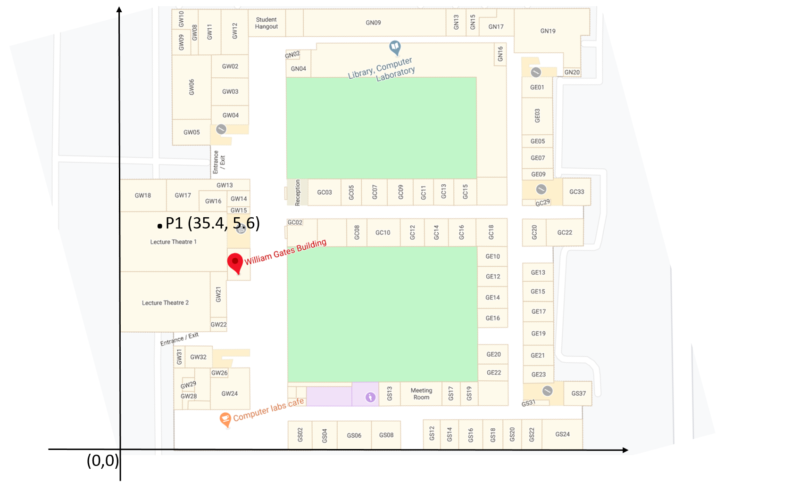
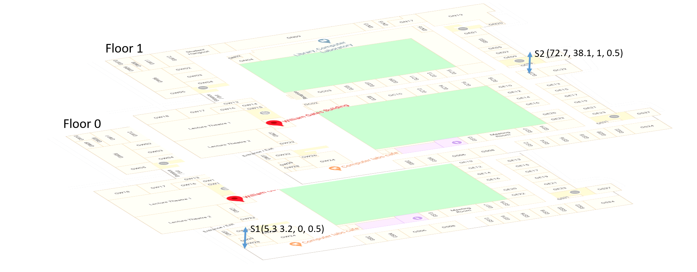
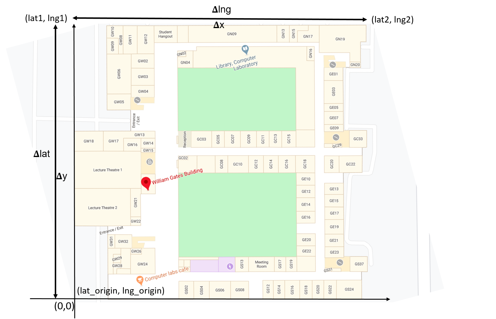
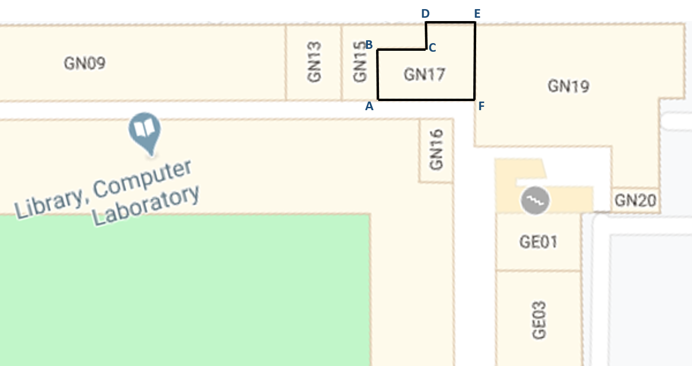

# Adaptive City Program sensor data strategy

This repo is intended to pull together the multiple approaches we're taking to normalize
the data coming in from our various sensors and sources.  This does *not* mean we assume
some miraculous uber-standard will magically make all the data sources adhere to common
protocols and formats. Rather, we are assuming the data will continue to be tailored to
each source and consequently be fairly diverse and we will take steps *where appropriate*
to make the data manageable.

## Summary of our approach

1. We propagate the data around our platform using JSON objects. This provides readability
plus essential flexibility in the data format.

2. We are likely to annotate the data with *additional* data properties (such as a normalized
sensor identifier property) but this is provided *as well as* whatever was in the data before,
rather than replacing it.

3. Where possible we enhance or normalize the data as far *upstream* as possible.
The Adaptive City Platform has a data-flow architecture with much processing in real-time
from the original sensor inputs to derived calculations, storage and visualization downstream. We
aspire to have much of the processing downstream independent of the specifics of the original
source. For example, producing a time vs. scalar chart of some data reading does not itself need
to understand the complexities of the data source.

4. Some properties are common to the majority of sensor data and we are seeking to normalize these
first. These include:
    * sensor identifier
    * timestamp most relevant to the data reading
    * location of the sensor
    * the confidence or reliability of the reading

In addition we may be able to generalize *some* of the data payload, for example by noting
that a for a given sensor or sensor type a `co2` reading in units `parts-per-million` is
available in sensor data property `payload_decoded > readings > co2`.

There are two significant platform elements relevant to our approach:

1. `acp_decoders`: a real-time component part of the
[acp_local_mqtt](https://github.com/AdaptiveCity/acp_local_mqtt) project, which subscribes to
incoming data and allows the dynamic addition of *decoders* capable of extracting and normalizing
key properties such that the annotated data can be re-published for consumption further
downstream like any other real-time data source.

2. The `ACP sensor metadata database` (documented below) which acts as a repository for
persistent metadata regarding the sensors which is accessible via an API for any process
during the data flow. For example this includes the `location` of the non-moving sensors.

## Standard data fields

### Summary

`acp_id`: sensor identifier, globally unique e.g. `elsys-eye-049876`.

`acp_type`: sensor type, determines data format e.g. `elsys-eye`.

`acp_event`: event type, for timestamped events, e.g. `openclose`.

`acp_event_value`: qualifier or data reading for event, e.g. `open`.

`acp_ts`: epoch timestamp most relevant to data reading or event, e.g. `"1586461606.465372"`.

`acp_lat`, `acp_lng`, `acp_alt`: WGS84 location information most relevant to reading or event.

`acp_location`: location using a custom coordinate system e.g. `{ "system": "WGB", "x": 12, "y":45, "f": 1 }`.

`acp_confidence`: a value `0..1` indicating the reliability of the sensor reading.

### Identity

`acp_id` is our globally-recognized string containing a sensor identifier. In many cases our
feedhandlers or MQTT decoders will extract the relevant string from a custom data format and
use this to populate `acp_id`. A simple agreed property name for the sensor identifier means
much of our system can proceed independent of the sensor type, e.g. selecting messages from
a particular sensor. It is (strangely) common for retail sensors sending readings via MQTT to
*not* include their sensor identity in the data message, rather embedding it somewhere within
a proprietary MQTT topic format. In this case the ACP decoders will typically extract the sensor
id from the topic and add a `acp_id` value to the data message.

`acp_type` is the common string property which hints at the sensor type, e.g. `elsys-co2`. If
included in the raw incoming data (i.e. from our own sensors) this allows rapid selection of
appropriate stream processing, rather then a complex heuristic based on the message content
or format. If missing from the original data, we aim to attach this property as early as
practicable in the stream processing.

### Events

Incoming sensor data messages to the platform can be broadly categorized as *periodic* or
*event* based. The Adaptive City platform is designed throughout to handle events in a
timely manner, and includes pre-defined data fields to make event-based messages easy to
recognize.

`acp_event` contains a globally-recognized string defining the event *type*, e.g. from the
window/door sensor:
```
"acp_event": "openclose"
```

`acp_event_value` is a simple (optional) additional property which can be included for an
event, e.g.
```
"acp_event_value": "open"
```

Note that these common properties are *in addition* to the data that the sensor will include
in its message anyway. They are a convenience such that the recognition of significant
events can be less complex for downstream processing which is likely to ignore or analyze the
message in more detail.

### Time

`acp_ts` is intended for the property containing the timestamp most relevant to the sensor
data reading, containing the floating point seconds in epoch stored in a string. For example:
```
"acp_ts": "1586461606.465372"
```

Sensors designed within the project will include `acp_ts` in their transmitted data as the
definitive time of the sensor reading, along with other timestamps from the internal processes of
the sensor.

Sensors (and other sources) from 3rd parties may include their time reference in some
proprietary format. In this case a suitable decoder from `acp_decoders` may create the `acp_ts`
property from the encoding of time in the data.

In the absence of any recognized time value in the sensor data, the `acp_decoders`
`DecoderManager` will create `acp_ts` with the current system timestamp.

### Spatial coordinates

We require consistent support for **three**  parellel location reference systems:

1. **Global:** The only definitive common reference system constituting of latitude, longitude and altitude. Necessary for outdoor sensors and
the coordinate system used while interacting with 'map' views of sensors or data.

2. **In-building coordinates:** This will be a spatial coordinate system typically unique to a given building, typically
used when interacting with in-building floorplan or 3D views of sensors or data. Sensors that transmit their position in the
building (i.e. particularly sensors that move around) may use this system in their sensor data.

3. **Building object hierarchy:** Often used in Building Information Models. It reasonable for a sensor (or monitored device)
to be recorded as being in location `FE11` i.e. a room/office which relates to BIM data structured as `site`..`building`..`floor`..
`room`..`window`. This hierarchy is often natively used when collating or browsing in-building information (e.g. the electricity
use in lecture theaters, William Gates Building).

Effective support implies a set of **API's** which support:

1. Translation between these location reference systems. This does not necessarily need to be perfectly granular, e.g. for
some purposes a mapping of all in-building coordinates to a single lat/lng/alt will allow macro processing at a map level including
outdoor and in-building sensors.

2. Rapid access to current and historical locations of assets (i.e. sensors and other objects of interest). It should be
feasible that a lookup of the data occurs at the rate of the incoming sensor data.

3. An ability to update the sensor and asset metadata (such as location) such that 'downstream' processing recognizes the
change with appropriate timeliness either by referring to the definitive metadata source on the arrival of each sensor data message
or by providing a 'push' mechanism when the metadata changes.

#### Global

Global position information for the sensor data is standardized as:

* `acp_lat`: floating point WGS84 latitude (North positive)
* `acp_lng`: floating point WGS84 longitude (East positive)
* `acp_alt`: floating point WGS84 altitude in meters.

For mobile sensors, location information is likely to included in the sensor data and this may be
interpreted by `acp_decoders` such that these properties can be populated (if the sensor has not
already).

Alternatively, the location information for a sensor may be provided by the sensor metadata database (see
below), via an API lookup using the sensor identifier.

#### In-building coordinates

In-building position information may use an alternate coordinate system (for example as x,y coordinates in meters plus
a floor number and height from the floor reference as z). This information will be supported in the Platform via a `acp_location` property for example (this is not
a genuine system in use):

```
"acp_location": { "system": "WGB", "x": "20.33", "y": "53.22", "f": "1", "zf":"0.5"}
```
In this case, the `system` property of the `acp_location` JSON object determines the expected other properties
representing the location, in this case `x,y,f,zf` where `x` and `y` are in meters relative to some arbitrary `0,0`
and orientation, a `f` is a floor number, and `zf` is the height of the sensor calculated with the floor as reference. Below we show an example of such a system for the William Gates Building (WGB).



Considering the above figure as a reference, with the origin at the lower left corner, any point in the building could be assigned an `x` and `y` value corresponding to its distance from the axis. For eg., the point P1 in the Lecture Theatre 1 would have its `x,y` set as `35.4,5.6`.



The figure above shows how the z-axis would be recorded as a combination of floor number and relative height from the floor reference. Both sensor S1 and S2 are `0.5 m` above the floor reference, so would get the coordinate assigned as `(5.3 3.2, 0, 0.5)` and `(72.7, 38.1, 1, 0.5)
` respectively.

The sensor metadata database will include information enabling the `acp_location/system` to be translated to
`acp_lat`, `acp_lng` and `acp_alt`.

#### Object-level hierarchy

We will use the data currently contained in the IfM BIM (Building Information Model) as a typical example of extant
metadata relating to in-building assets and sensors.

The objective is to support navigating the hierarchical model *including* real-time and historical information available
from sensors, including sensors that may continually change information the BIM assumes is static (for example
a robot leaner that moves around).

The BIM system itself is likely to fall short of our requirements for rapid programmatic access to the reference data
or the ability to update the information promptly and communicate those changes, nevertheless a system design approach is
required that assumes some substantive building reference information remains embedded in an 'external' system.

In the BIM system, we consider each object is treated as a crate owing to the analogy of hierarchy with each smaller crate put into a bigger one. For eg, WGB would be a crate with the floors being smaller crates put into the WGB crate. The rooms on each floor would be separate crates put into crates corresponding to the floor crates. An example representation is shown below;

| crate_id 	| parent_crate_id 	|                                  location                                 	|                        boundary                        	| crate_type 	|
|:--------:	|:---------------:	|:-------------------------------------------------------------------------:	|:------------------------------------------------------:	|:----------:	|
|    WGB   	|        -        	| {"system":"GPS", "acp_lat":52.2108765, "acp_lng":0.0912775, "acp_alt":0.0} 	|         {"system":"WGB",[0,0,0,78,73,78,73,0]}         	| "building" 	|
|    GF    	|       WGB       	|             {"system":"WGB", "x":36.5, "y":39, "f":0, "zf":0}             	|         {"system":"WGB",[0,0,0,78,73,78,73,0]}         	|   "floor"  	|
|   GN15   	|        GF       	|              {"system":"WGB", "x":38, "y":70, "f":0, "zf":0}              	| {"system":"WGB",[35,68,35,73,40,73,40,73,38,70,38,68]} 	|   "room"   	|

In the above example, each column is defined as follows;

`crate_id` - An identifier for the particular object.\
`parent_crate_id` - The crate which holds the object with the given crate_id. Assuming a building as the outermost crate, WGB has no parent.\
`location` - A unique location identifier for the object. When inside a building, the location would the corresponding In-building system.\
`boundary` - This field stores the coordinates of the vertices of the polygon forming the object. Any object would be mapped to a polygon having each vertex corresponding to an In-building coordinate. The standard being to start from the vertex on the leftmost lower corner of the object and then moving counter-clockwise. \
`crate_type` - The type of that particular object.

#### Coordinate Translation

##### In-building <-> Global



As shown in the above figure, the translation uses the Global coordinates at the three corners of the building for translation. The (`lat`,`lng`) at the origin of the In-building coordinate system is taken as (`lat_origin`, `lng_origin`). A pair of global coordinates (`lat1`, `lng1`) and (`lat2`, `lng2`) are selected such that an inverse L could be formed.

For the translation on the XY-plane, we would be requiring vertical and horizontal shifts which could be calculated as;

<blockquote>
vertical shift (vs) = &Delta;y/&Delta;lat

horizontal shift (hs) = &Delta;x/(cos(lat)*&Delta;lng)
</blockquote>

###### Global -> In-building
Thus, given global coordinates (lat, lng) the translation to In-building coordinates (x,y) would be calculated as;

<blockquote>
x = (lng - lng_origin)*hs

y = (lat - lat_origin)*vs
</blockquote>

###### In-building -> Global
Alternatively, given (x,y), the translation to (lat, lng) would be calculated as;

<blockquote>
lat = lat_origin + (y*&Delta;lat)/&Delta;y

lng = lng_origin + (x*cos(lat)*&Delta;lng)/&Delta;x
</blockquote>

###### Translation along z-axis

Each floor number would be assigned a height in meters with respect to the system being followed and stored in a table. So the translation along the z-axis would be;

<blockquote>
alt = floor height + zf
</blockquote>

It should be noted that for a different building, the values of (lat_origin, lng_origin, &Delta;lat, &Delta;lng, &Delta;x, &Delta;y) would change.

##### In-building <-> Object-level

This translation would utilize a mapping between the two systems described by the `boundary` field in the BIM. Any object in the Object-level system would mapped to a polygon having each vertex corresponding to an In-building coordinate.

With the available mapping, any point in the In-building system could be mapped to being in any one of these polygons and consequently to the corresponding room in the Object-level system.

An example is given in figure below. The room `GN17` in the Object-level system would be mapped to the coordinates belonging to the polygon `ABCDEF`. Conversely, any point inside this polygon would be mapped to `GN17`.



### Confidence

`acp_confidence` indicates a general probability a data reading is reliable, on a scale `0..1`. This property is
useful as a common generalization. For example, a sensor that is deriving traffic speed from passing vehicles
will assign more confidence to a value based on many vehicles than on a few. *How* the confidence value is
calculated will differ by sensor type and it is currently not clear how this should best be normalized.

The essential point is that confidence in a sensor reading is a general issue, not particularly limited to a few
sensor types, so it is helpful on the Adaptive City platform to abstract this into a common property. Note this is, as with
the other standardized fields, *in addition* to the data values the sensor will send anyway allowing downstream processing
knowledgeable about the intricacies of the particular sensor to make its own interpretation of confidence or accuracy.

## Sensor metadata database

Name: postgres

## Tables
### metadata
This table stores the metadata information of all the sensors being deployed. It has two columns as of now;
+ acp_id (VARCHAR): This is the unique id given to each of the deployed sennsors.
+ info (jsonb): This currently stores all the information of the sensor. As different category of sensors could have specific metadata information unique to itself, we opted for a jsonb type.

Example Rows:

|      acp_id      |                                                                  info                                                                 |
| ---------------- | ------------------------------------------------------------------------------------------------------------------------------------- |
| avatar-test-001  | {"ts":"1585138617","type":"smartplug","owner":"rv355","source":"mqtt_csn","features":["power"],"acp_location":{"x":"2131.33","y":"53272.22","f":1,"z":"1","system":"WGB"}} |
| aoycocr-test-001 | {"ts":"1585138617","type":"smartplug","owner":"jb2328","source":"mqtt_csn","features":["power"],"acp_location":{"x":"2654.33","y":"53432.22","f":1,"z":"1","system":"WGB"}} |
| gosund-test-001  | {"ts":"1585138617","type":"smartplug","owner":"mrd45","source":"mqtt_csn","features":["power"],"acp_location":{"x":"2664.33","y":"53432.22","f":0,"z":"1","system":"WGB"}} |
| ijl20-sodaq-ttn  | {"ts": "1585868424", "type": "temperature", "owner": "ijl20", "source": "mqtt_ttn", "features": ["temperature"], "acp_location": {"system": "GPS", "acp_alt": "15", "acp_lat": "52.21124", "acp_lng": "0.09383"}} |

In the above example the info field includes;
+ acp_ts: The Unix timestamp when the metadata was stored. Owing to the fact that the location could change later we have opted to include timestamp.
+ type: type of sensor
+ owner: the owner of the device
+ source: the mqtt source which is publishing the messages from the sensor
+ features: set of features of which the sensor logs information of
+ acp_location: The location of the sensor. This could be either inside a building in which case we use building specific system like WGB and (x,y,f,z). This system could be mapped to a latitude, longitude and altitude system and vice-versa.

## ACP Sensor Metadata API (Work in Progress)

#### Requirements
1. Python3
2. flask and psycopg2. Could be installed through pip

#### Installation
Before starting the API server follow the following steps;
1. Install postgres and restore the `postgres.bak` file in the database `postgres`.
2. Add the necessary details in the `CONFIG.py` file.

The API endpoints could be accessed by running the following command and then querying *http://localhost:5000/endpoint*

```
python acp_metadata_api.py
```

#### Add/Update Sensor Information
You need to visit *http://localhost:5000/admin* to add/update any sensor. Add any admin username and password in the `CONFIG.py` file for local testing. Currently the login is through a single user which will be extended to multiple users on deployment.

Fill in the necessary details when the form loads. Each input field has a tooltip to describe it. The location field has validation and need to be of specific format to be accepted.

TODO:
1. Multiple user login

#### API References

+ `/admin` - Opens a form to add sensor information.\
+ `/api/sources` - List all the sensor sources.\
+ `/api/sensors?source=` - List all the sensors belonging to the given source.\
+ `/api/features?sensor=` - List all the feature information the given sensor could provide.\
+ `/api/ctog?system=&x=&y=&f=&z=` - Given x, y, f and z of a given system, returns the corresponding Global coordinates.\
+ `/api/gtoc?acp_lat=&acp_lng=&acp_alt=&system=` - Given acp_lat, acp_lng and acp_alt, returns the corresponding In-building coordinates of the queried system.\
+ `/api/ctoo?system=&x=&y=&f=&z=` - Given x, y, f and z of a given system, returns the corresponding object-level values.\
+ `/api/otoc?system=&room=&inbuildsystem=` - Given the room and system, returns the x, y, z and f in the in-building system specified.
